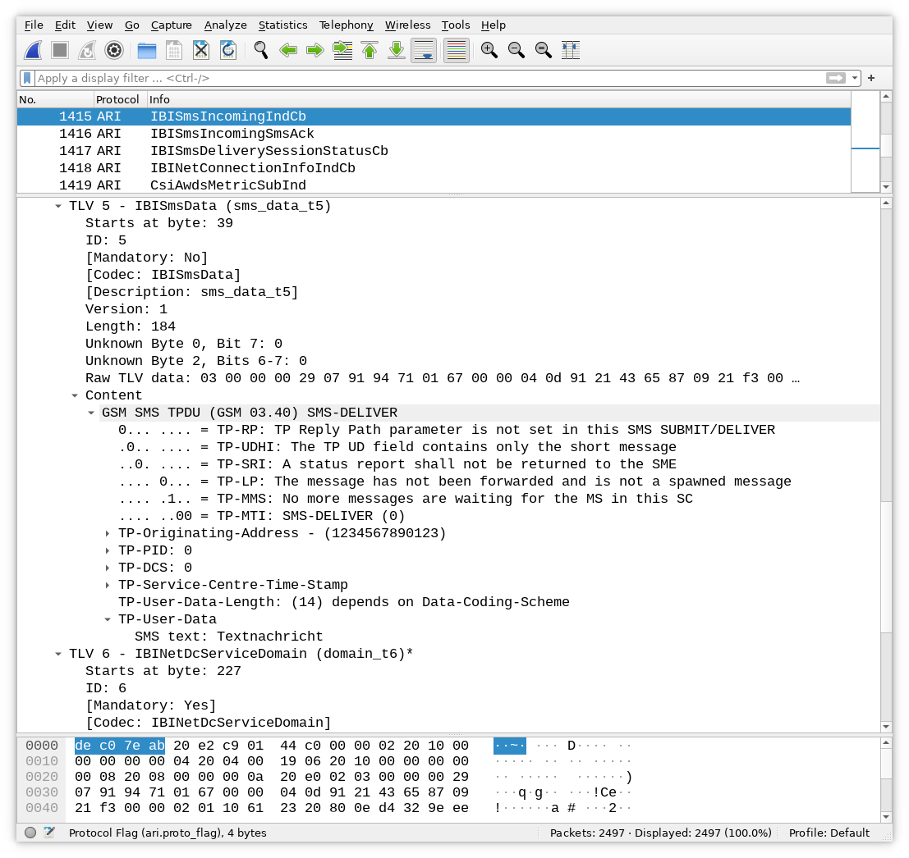
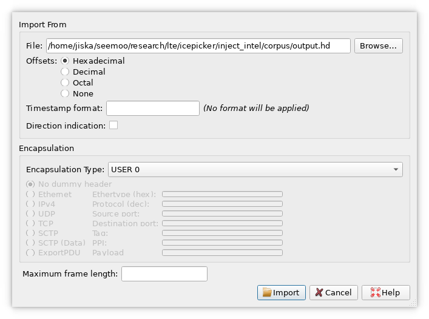

<div align="center">
    <br><br>
    
    <br>
    ARI - Wireshark - Dissector
    <br>
    <br>
    <hr>
</div>

This repo contains a Wireshark dissector for the Apple Remote Invocation (ARI) protocol, used between Intel baseband chips and the
iOS CommCenter for various management purposes, SMS, telephony and much more. Since it is a management interface, some
information is using other interfaces, such as audio from calls or network traffic.
Only Intel basebands support ARI, Qualcomm basebands use QMI.
Some iPhones were produced with both chip flavors, depending on the region. These
scripts were tested on an iPhone 11, SE 2020, 8, and 7. The iPhone 12 is Qualcomm only, even though Apple acquired
the baseband division of Intel recently. More information what ARI does can be found in the rC3 talk
[Fuzzing the phone in the iPhone](https://media.ccc.de/v/rc3-11358-fuzzing_the_phone_in_the_iphone)
as well as our ESORICS paper _ARIstoteles - Dissecting Apple's Baseband Interface_.
After successful installation and packet capture, the output looks as follows:



## Installation

1. Clone this repository into your Wireshark plugin folder `~/.local/lib/wireshark/plugins/` (on Linux) or `%APPDATA%\Wireshark\plugins\` (on Windows) and restart Wireshark.  
   Can also be copied to a subfolder with the exact Wireshark version, i.e., `~/.local/lib/wireshark/plugins/3.4/`.  
   For more information visit the [Wireshark documentation](https://www.wireshark.org/docs/wsug_html_chunked/ChPluginFolders.html).
2. Go to `Edit -> Preferences... -> Protocols -> DLT_USER -> Edit` and press the "+" button to add a mapping for USER 0 (DLT=147) with the payload protocol `ari`.  
   If this is already mapped, you may also choose any other ID and it should work (untested) by replacing `USER_0` with your mapping in the following sections.
3. All set! Let's start dissecting some ARI packets!

Tested on Wireshark v3.6.0 with Lua 5.2.4.

Currently contains extracted types and information from iOS version: 18.3.1

## Usage

### Watch ARI messages on an iPhone

The [tools/](tools/) folder contains the [`watch_syslog.py`](tools/watch_syslog.py) to capture packets from
`idevicesyslog` output (no jailbreak required) as well as the
[`watch_frida.py`](tools/watch_frida.py) script that captures them by hooking `CommCenter` with Frida (jailbreak required).
The packets will be shown in Wireshark and you can record and save the trace, if needed.

```
   cd tools
   python watch_syslog.py
   python watch_frida.py
```

The scripts will automatically try to start an `idevicesyslog` process or Frida script on the iPhone and a Wireshark
process. Attack your iPhone while running the script - ideally only one iPhone - and mutually trust it.
Usually, the `idevicesyslog` output is stripped, but after installing the
[Baseband Debug Profile](https://developer.apple.com/bug-reporting/profiles-and-logs/) on a non-jailbroken device
ARI messages become visible. The baseband debug profile expires after 21 days, but it can be re-installed afterwards.

**Notice: Due to all data being sent back to the scripts the performance might be slow on high traffic but does usually
not cause any problems.**

**Notice: The Frida version does currently output ARI messages sent to the baseband with a sequence number of 0
and does not include the correct value since the method does not receive the correct sequence number.**

### Importing data from a raw packet trace

Another packet format are separate files per packet. This might be the case for a fuzzing corpus or some of the
examples provided here. Instead of watching packets live on an iPhone, such files have to be concatenated into a
single binary file and then opened in Wireshark. Since Wireshark does not know the packet type, this has to be added
manually.

1. Convert your ARI binary trace to a single hexdump, for example using our [`corpus_concat_hexdump.sh`](tools/corpus_concat_hexdump.sh)
   script, found in the [tools/](tools) folder.  
   `corpus_concat_hexdump.sh trace_folder/ trace.hd`.
2. Open a hexdump via `File -> Import from Hex Dump...`.
3. Choose `USER_0` as the `Encapsulation Type`.



### Inject ARI messages into an iPhone

The scripts [`inject_custom_packet.py`](tools/inject_custom_packet.py) and [`replay_custom_packet.py`](tools/replay_custom_packet.py)
can inject or replay custom payloads. This might be interesting for fuzzing and other testing purposes, such as instrumenting
the baseband chip. Injection works using Frida, meaning that these scripts require a jailbreak.

```
    cd tools
    python replay_custom_packet.py ../examples/crashes/CellMonitor_1
```

## Examples

- [examples/crashes](examples/crashes/) contains replayable crashes and bugs. Some of them were fixed in iOS 14.3, some in iOS 14.6.
  Note that the resulting crash can be different depending on the underlying hardware, e.g., some crashes might only occur
  on an iPhone 7/8.
- [examples/captures](examples/captures/) contains a Wireshark trace to test the dissector even without iPhone.

## Developing

See [DEVELOPING.md](DEVELOPING.md) for details on how to extend the parsers, implementing new ones or even running
the provided [Ghidra](https://github.com/NationalSecurityAgency/ghidra) extraction scripts.

## Publications

- [Kröll, Tobias (2021): **"ARIstoteles: iOS Baseband Interface Protocol Analysis"**](https://tuprints.ulb.tu-darmstadt.de/id/eprint/19397)  
   This project was initially developed and documented in the bachelor thesis by Tobias Kröll.
- [Kröll T., Kleber S., Kargl F., Hollick M., Classen J. (2021): **"ARIstoteles – Dissecting Apple’s Baseband Interface"**](https://doi.org/10.1007/978-3-030-88418-5_7)  
   Our paper about ARI dissection and fuzzing presented at ESORICS 2021.

## License

ARIstoteles is open source software released under the MIT license. See [LICENSE](LICENSE) for more information.
